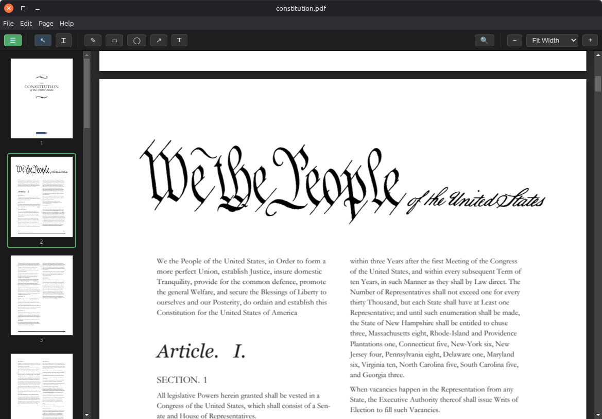
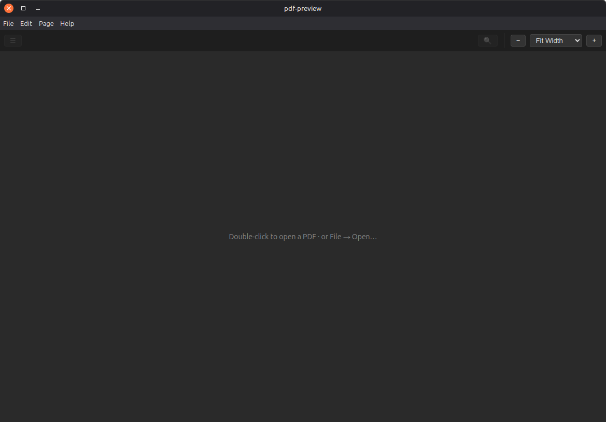

# pdf-preview

A fast, native-feeling PDF viewer and editor for Linux — the macOS-Preview
experience, in an AppImage.

No browser chrome. No cloud round-trip. No PDF you can't open. Just open
the file, do the thing, save it. The whole UI is custom; we own every pixel.

## Screenshots

<p align="center">
  <a href="resources/open.png">
    
  </a>
  <a href="resources/empty.png">
    
  </a>
</p>

<p align="center"><em>Click a screenshot to view it full size.</em></p>

## Install

Grab the latest `pdf-preview-*.AppImage` from
[Releases](../../releases), then:

```sh
chmod +x pdf-preview-*.AppImage
./pdf-preview-*.AppImage
```

On first launch the app installs a `.desktop` entry and an icon under
`~/.local/share/`, so it shows up in your application launcher and in the
file manager's "Open with" menu — without touching your existing default PDF
handler. A one-time dialog asks if you'd like it to be the default; you can
say "Later" or "Don't show this again" and revisit through Help → Make
Default PDF Viewer…

### Better font rendering

PDFs that reference Microsoft Core Fonts without embedding them (CID
Identity-H with no ToUnicode) only render correctly when those fonts are
installed locally. On Debian / Ubuntu:

```sh
sudo apt install ttf-mscorefonts-installer
```

Without this, those documents fall back to substitute fonts and glyphs may
look wrong.

## Keyboard shortcuts

| Shortcut | Action |
|---|---|
| `Ctrl+O` | Open |
| `Ctrl+S` / `Ctrl+Shift+S` | Save / Save As |
| `Ctrl+F` | Find |
| `Ctrl+L` | Toggle sidebar |
| `Ctrl+0` / `Ctrl+1` / `Ctrl+2` | Fit page / actual size / fit width |
| `Ctrl+±` | Zoom in / out |
| `Ctrl+P` | Print |
| `Ctrl+[` / `Ctrl+]` | Rotate left / right |
| `Ctrl+Z` / `Ctrl+Shift+Z` | Undo / redo |
| `V` `T` `R` `O` `A` `N` `F` | Select / text / rect / oval / arrow / note / free-text |
| `↑ ↓ PgUp PgDn Space Home End` | Page navigation |
| `Esc` | Close search / cancel tool |

## Build from source

```
git clone <repo>
cd pdf
npm install
npm run dev               # Electron + Vite HMR
npm run build:appimage    # → release/pdf-preview-<ver>.AppImage
```

Requires Node 20+. Built with TypeScript, React, Zustand, and Electron 32.

## Limitations (be aware before you commit)

- No cryptographic signatures (PAdES/CMS) — out of scope for v1.
- No freehand ink, highlight, underline, or strikethrough annotations yet.
- No OCR or scanning.
- XFA forms render as static appearances; values can't round-trip back to the
  file. (Acrobat XFA is a niche format — most "modern" PDFs are AcroForm and
  do work.)
- If you edit page order, rotate, or annotate a form-filled PDF, the
  pdf-lib save pipeline takes over and form values entered in this session
  aren't preserved (the AcroForm dict gets dropped). A future revision will
  layer pdf-lib edits on top of the PDFium-saved bytes.

## License

MIT. Built on PDFium (BSD), pdf-lib (MIT), Electron, React, and Zustand.

Inspired by Apple's Preview. Made for Linux.
